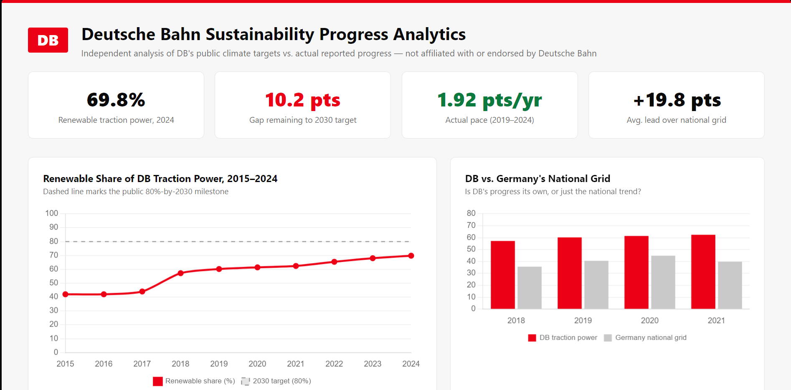
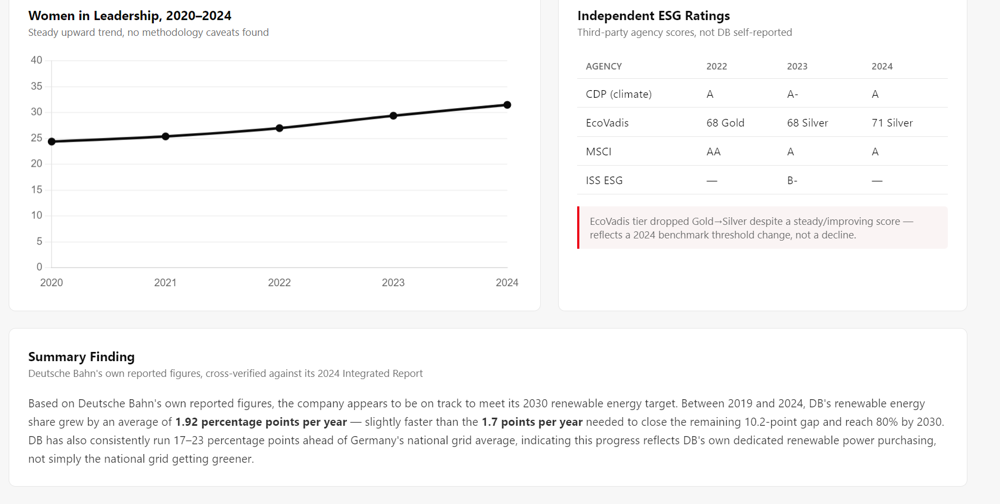

# Deutsche Bahn Sustainability Progress Analytics

An independent analysis of Deutsche Bahn's public climate commitments —
80% renewable traction power by 2030, 100% by 2038, net zero by 2040 —
checked against DB's own historically reported progress. Built
end-to-end: sourced data, a SQLite database, Python-driven analysis, a
Power BI chart, and a custom HTML dashboard.

**Independent analysis — not affiliated with or endorsed by Deutsche Bahn.**

## Dashboard Preview

## Problem Statement

Deutsche Bahn has made specific, numbered public climate commitments,
but no single place brings its own scattered yearly figures together to
actually check whether it's on pace to meet them. This project pulls
DB's own official numbers into one place and calculates the real answer.

## Key Finding

Based on Deutsche Bahn's own reported figures, the company appears to be
on track to meet its 2030 renewable energy target. Between 2019 and
2024, DB's renewable energy share grew by an average of **1.92
percentage points per year** — slightly faster than the **1.7 points
per year** needed to close the remaining 10.2-point gap and reach 80%
by 2030. DB has also consistently run 17-23 percentage points ahead of
Germany's national grid average, indicating this progress reflects DB's
own dedicated renewable power purchasing, not simply the national grid
getting greener. Full write-up in docs/findings.md.

## Business Questions

Full list in docs/business_questions.md.

1. Is DB actually on track for its 80%-by-2030 renewable energy target?
2. How has DB's renewable percentage changed year over year - steady, or jumpy?
3. Is DB's progress genuinely outperforming Germany's national grid, or just riding the same trend?
4. How has women's representation in DB leadership changed, 2020-2024?
5. What do independent ESG rating agencies say about DB, separate from DB's own claims?

## Tech Stack

| Technology | Purpose |
|---|---|
| Python | Data loading and calculation (src/build_db.py) |
| SQLite | Structured database for the historical time series |
| Power BI | Interactive trend chart |
| HTML / CSS / Chart.js | Custom-styled dashboard |
| Git and GitHub | Version control |

## Project Structure

db-sustainability-analytics/
├── data/
│   └── raw/                 Sourced CSVs, each traceable to DB's own
│                             official spreadsheet or 2024 Integrated Report
├── db/                      Generated SQLite database (rebuildable)
├── src/
│   └── build_db.py          Loads CSVs into the database, runs the
│                             gap-to-2030-target calculation
├── docs/
│   ├── business_questions.md
│   └── findings.md
├── dashboard/
│   ├── dashboard.html       Styled, branded dashboard
│   └── screenshots/
└── README.md

## Data Sources

All figures trace back to real, cited sources:
- Deutsche Bahn's official KPI spreadsheet (kpi.deutschebahn.com)
- Deutsche Bahn's 2024 Integrated Report (independently cross-verified
  against the KPI spreadsheet - both agree on every overlapping figure)
- Macrotrends, for Germany's national grid renewable-energy benchmark

## Running This Project

python src\build_db.py

Rebuilds the SQLite database from the raw CSVs and prints the
gap-to-2030-target calculation. Open dashboard/dashboard.html directly
in a browser to view the dashboard.

## Status

Complete (v1). Possible next steps: extend the historical series further
back, add a live connection to DB's Timetables API, add PostgreSQL as
an alternative to SQLite for production use.